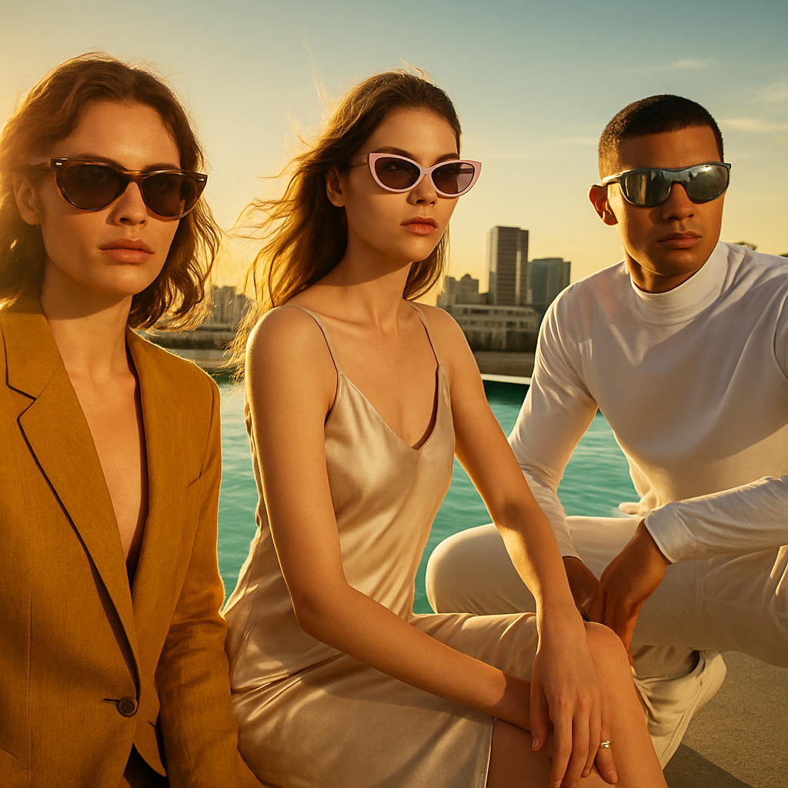

# 🕶️ Summer Sunglasses Campaign – Executive Summary

## 📊 Refined Trend Insights
Executive Summary – Summer 2026 Sunglasses Campaign (08/02/2026)

1. Trend Highlights  
 • Chunky Acetate Frames  
   – Bold, retro-inspired silhouettes in saturated hues. Provides a timeless yet fashion-forward statement.  
 • Modern Cat-Eye Silhouettes  
   – ’50s heritage meets contemporary refinement: upswept corners redefined with sharper lines and discreet embellishments.  
 • Futuristic & Sport-Chic Designs  
   – Sculptural wrap-around and shield lenses with technical details for an athleisure-ready, forward-looking aesthetic.

2. Hero Product Selections  
 • SG002 “Wayfarer”  
   – Chunky acetate, angular geometry. Aligns squarely with the season’s retro-bold direction.  
   – Inventory: 6 units | Price: $92 | Target: Broad-appeal statement piece  
 • SG003 “Mystique”  
   – Elevated cat-eye with refined curves and luxe temple accents. Feels exclusive and fashion-forward.  
   – Inventory: 3 units | Price: $88 | Target: Trend-driven, style-focused customers  
 • SG004 “Sport”  
   – Single-lens wrap design with rubberized grips. Captures the growing athleisure and performance-meets-street trend.  
   – Inventory: 11 units | Price: $144 | Target: Premium-segment, active lifestyle consumers

3. Strategic Rationale  
 • Comprehensive Trend Coverage  
   – These three silhouettes span the key frame movements—bold acetate, refined retro, and sporty-futuristic—ensuring broad market relevance.  
 • Balanced Price & Inventory Mix  
   – Prices range from entry (≈$90) to premium ($144), optimizing appeal across budget tiers while maintaining healthy stock levels.  
 • Visual & Brand Impact  
   – From statement-making “throwback” to chic “retro-glam” and high-tech “athleisure,” each style reinforces our summer story and drives differentiated shelf presence.

Recommendation  
Deploy SG002, SG003 and SG004 as the core of our Summer 2026 sunglasses campaign. This curated trio delivers on current fashion movements, supports tiered pricing strategies, and maximizes visual impact—positioning us for a high-velocity season.

## 🎯 Campaign Visual

    

## ✍️ Campaign Quote
Sun-Kissed Style: Retro, Chic, Futuristic Summer Shades

## ✅ Why This Works
Evokes the golden‐hour poolside setting and spotlights the campaign’s three key trends—chunky acetate retro frames, modern cat-eye elegance, and bold futuristic wraps—inviting customers to embrace summer’s diverse, fashion-forward silhouettes.

---

*Report generated on 2026-08-02*
