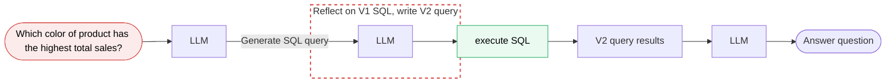

# Initial Notes

## Agentic Design Patterns
1. Reflection - check code correctly for correctness, style and efficiency, and give constructure critism for how to improve it
2. Tool use - web search tool, code execution tool etc
3. Planning - please generate an image where a girl is reading a book and her pose is the same as the boy in the image example.jpg, then please describe the new image with with your voice
4. Multi-agent collaboration

### Tool Use
* Analysis
  - Code execution
  - Wolfram Alpha
  - Bearly code interpreter
* Information Gathering
  - Web search
  - Wikipedia
  - Database Access
* Productivity
  - Email
  - Calendar
  - Messaging
* Images
  - Image generation
  - Image captioning
  - OCR

### Planning
 

### Multi-agentic Workflows

## Reflection Design Patterns
* reflection with external feedback (ie. run the code)
* 
* Why use reflection pattern, rather than direct generation
  - zero-shot prompting (no examples)
  - One-shot (single example)
  - Two-shot (two examples)
  - Multi-shot (more examples)
  
| Example | Problem | Reflection prompt |
| ---------- | ----------- |---------------|
| Generate html table | Missing '>' | Validate the html code |
| How to brew a perfect cup of tea | Missing steps | Check instructions for coherence and completeness |
| Generating domain names | Name has unintended meaning, or is hard to pronounce | Does domain name have any negative connotations? Is the domain name hard to pronounce? |

* Brainstorming domain names
  - review the domain names you suggested
  - check if each name is easy to pronounce and thus easy to spread via word of mouth
  - consider whether each name might mean something negative in other languages
  - then output a shortlist of only the names that meet these criteria

* Improving email
  - review the email first draft
  - check that the tone is professional and look for phrases that could be considered rude or insensitive
  - verify all facts, dates, and promises are accurate.
  - then write the next draft of the email.

 * clearly indicate the reflection action
 * specify criteria to check

### Chart Generation Workflow

   
 
### Evaluating the impact of reflection
**Create a dataset of prompts and answers - this is technique used in datatalks llm-zoomcamp)**

_run each time you change the reflection prompt_

### Reflection results

Comparison of having ground truth, no reflection, and with reflection (the reflection prompt is - reflecton V1 SQL , and write V2 SQL)
This is for objective tasks

| Prompts | Ground truth answer | No reflection | With reflection |
| :--- | :--- | :--- | :--- |
| **Number of items sold in May 2025?** | 1201 | 980 | 1201 |
| **Most expensive item?** | Airflow sneaker | Airflow sneaker | Airflow sneaker |
| **How many styles carried?** | 14 | 14 | 14 |
| **Accuracy Rate** | — | **87% correct** | **95% correct** |

This is for subjective tasks (by a human or use LLM to judge)

Grading with a rubric gives more consistent results - like scores binary 1 or 0 for each criteria and then add them all up.

#### Evaluating reflection
* Objective evals
  - Code-based evals are easier
  - Build a dataset of ground truth examples
* Subjective evals
  - Use LLM as a judge
  - Rubric-based grading is better
 
### Reflection using external feedback

  
